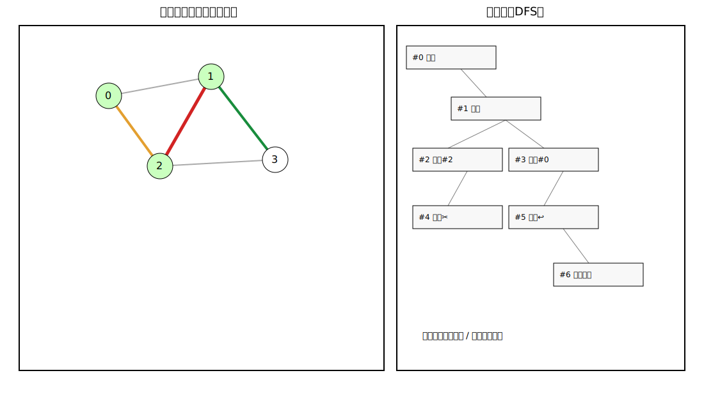

# Prim Tree Demo (Qt/C++)

用于演示“无向网 + 指定/随机起点 + Prim 思想求所有最小生成树（MST）”的 Qt Widgets 项目。

## 新增能力（本次重点）

- 支持**手工输入图**并可视化：
  - 邻接矩阵输入
  - 邻接表输入（每行 `u v w`）
- 支持选择起点模式：
  - 随机起点
  - 固定起点
- 支持动态展示 Prim 求解过程（展示第 1 棵 MST 的 trace）：
  - `下一步` 手动推进
  - `自动播放` 定时推进
  - 颜色高亮展示：当前树内顶点、候选最小边、已选边、当前选中边

- 新增 **分支树** 视图：
  - 按 DFS 展示“展开 / 选边 / 剪枝 / 回溯 / 成功到达最优解”的完整分支过程
  - 点击分支树节点可同步高亮图中的树内顶点、候选边、已选边、当前边
  - 支持过滤：仅显示最终可到达最优解的分支、隐藏被剪枝分支

## 输入格式

### 1) 邻接矩阵

- 使用空白分隔，必须是 `n x n` 对称矩阵。
- 对角线元素无意义。
- `-1` / `INF` / `X` 表示无边。
- 正整数表示边权。

示例：

```txt
0 2 3 -1
2 0 1 4
3 1 0 5
-1 4 5 0
```

### 2) 邻接表

每行一个无向边：`u v w`（顶点下标从 0 开始，`w > 0`）

示例：

```txt
0 1 2
0 2 3
1 2 1
1 3 4
2 3 5
```

## 算法说明（所有 MST）

普通 Prim 每步只选一条边，通常只得到一棵 MST。
本项目在每步中对“割边最小权候选”做分支 DFS：

1. 计算割边集合（`U` 与 `V-U` 之间边）
2. 找到最小权值 `w_min`
3. 对所有 `weight == w_min` 的边分别递归分支
4. 当边数达到 `n-1` 时得到一棵生成树
5. 用边集 key 去重，保留全部最优代价树

## 构建

```bash
cmake -S . -B build
cmake --build build
./build/prim_tree_demo
```

> 需要 Qt6（Core + Widgets）和 C++17 编译器。

## 目录

- `include/graph.h`：图抽象、邻接矩阵/邻接表、随机图工厂
- `include/prim_all_mst_solver.h`：Prim 分支枚举数据结构
- `src/prim_all_mst_solver.cpp`：求所有 MST 的核心实现
- `include/mainwindow.h` / `src/mainwindow.cpp`：输入解析、图形渲染与动画控制

## 分支树视图说明

点击右侧“分支树”中的任意节点，会同步更新左侧图状态：

- 绿色顶点：当前分支下已在树内的顶点
- 橙色边：当前割边最小候选边集合
- 绿色边：该分支路径上已选中的边
- 红色边：该分支节点对应本次选择的边（若有）

过滤选项：

- `仅显示可到达最优解分支`：隐藏所有无法到达最终最优解的探索路径
- `隐藏被剪枝分支`：隐藏 `cost > bestCost` 被剪掉的节点

演示图：


